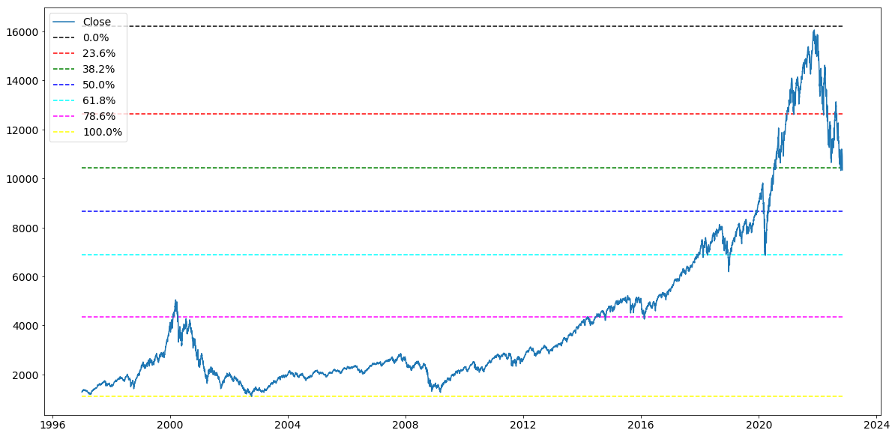
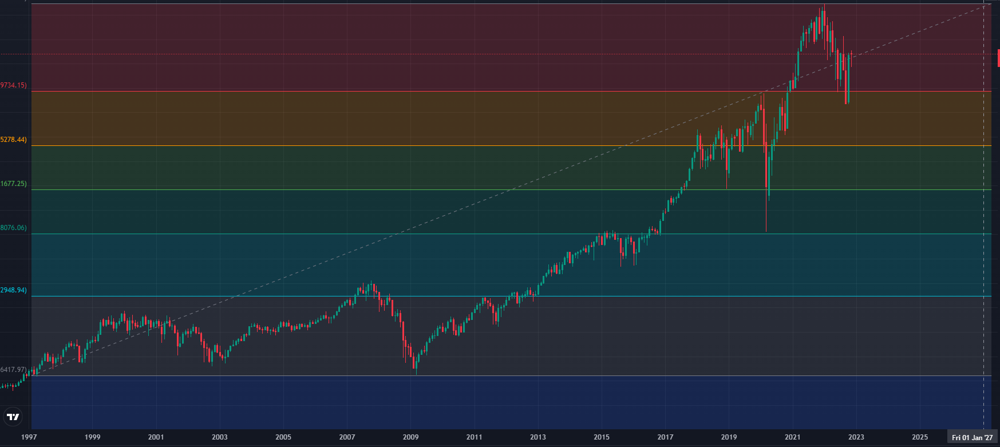

# Fibonacci Retracement and Analysis

* Fibonacci analysis of 3 major indicies over the past 25 years. Using this data we will analyze and detail entry points historically, as well as potential future entry points.


# Installion Guide

```
conda activate base
conda create -n project1env python=3.7 -y
conda activate project1env
conda install -c conda-forge python-dotenv -y
conda install -c anaconda nb_conda -y
conda install -c conda-forge nodejs=12 -y
conda install -c pyviz holoviz -y
conda install -c plotly plotly -y
conda install -c conda-forge jupyterlab=2.2 -y
conda install -c anaconda numpy==1.19 -y
conda install -c conda-forge matplotlib==3.0.3 -y
jupyter labextension install @jupyter-widgets/jupyterlab-manager --no-build
jupyter labextension install jupyterlab-plotly --no-build
jupyter labextension install plotlywidget --no-build
jupyter labextension install @pyviz/jupyterlab_pyviz --no-build
jupyter lab build
pip install yfinance
```

# Timeline
    - Day 1 : Proposal and Research
    - Day 2 : Building  Fibonacci Retracement in Python
    - Day 3 : Building and Finishing Retracement Code
    - Day 4 : Markdown and Documentation
    - Day 5 : Final touches to Markdown and Presentation Prep


# Project Team
* Tim Clemens 
* Max Heatter 
* Brandon Latherow
* Gregory Neubel Jr.

# Fibonacci Background
* A Fibonacci Sequence is a series of numbers, starting with zero and one, in which each number is the sum of the previous two numbers. This sequence extends to infinity and is summarized with the formula: 

* Fibonacci is based around the Golden Ratio which can be found all around in nature. The Golden Ratio is equal to 0.618 or 1.618. This ratio is created using the following formula: a/b = (a+b)/a =1.618... This ratio is then used to create a percentage is associates with being: 23.6%, 38.2%, 61.8%, and 78.6%. These percentage levels are used in retracement along with a 50% level. Although 50% is not a true Fibonacci Level or number it is used with the retracement to add accuracy for support and resistance.


# Data Analysis
* Using the Retracement of the total 25 year analysis, we were able to see how the historical crashes of these indicies correlated with the support levels of Fibonacci. On the other hand, as the indicies rose in value, and hit high points, the closing price had strong and consistant correspondance to the resistance levels over the time frame analyzed.
## Dow Jones

## Nasdaq Composite

## S&P 500


# Investing INFO??

# Challenges
* There were multiple challenges we had with this project, one of such challenges was expanding the Fibonacci Retracement Lines to future dates. We thought of a way of manually adding dates to the table with "null" values except for the "Date", but do to time constraints we could test the idea or put it into practice. 
* We also tried to make the retracement using hvplot instead of pyplot, but again due to time constraints we were unable to finish the retracement code.
* Lastly we had difficulty using our code to easily and accurately find trends using smaller sample sizes/data frames.


# Future Expanse 

### EXPANSION OF PYTHON LIBRARIES

* Python Technical Analysis 
  - TA-Lib ***(POTENTIALLY IMPLEMENT THIS INTO CURRENT PROJECT)***

* Machine Learning Libraries
  - Sci-kit-learn
  - Keras
  - Tensor Flow

* Python Trading Libraries For Backtesting
  - PyAlgoTrade
  - Zipline
  - PyBacktest (BACKTESTING)

* Python Data Collection
  - Ultrafinance
  - TWP (Trading WIth Python)
  - IBridgePy

### MODELING AND COMPARISON (LIKE THE BIG BANKS)

* Comparing Fibonacci Retracement with Machine Learning models such as
  - Monte Carlo Simulation
  - Markov Chain Simulation
  - Bootstrap
  - Black Scholes
  - Discrete Event Simulation

* insert image

# Resources
* https://www.investopedia.com/terms/f/fibonacciretracement.asp 
* https://blog.quantinsti.com/fibonacci-retracement-trading-strategy-python/
* https://towardsdatascience.com/fibonacci-retracements-in-python-470eb33b6362  

